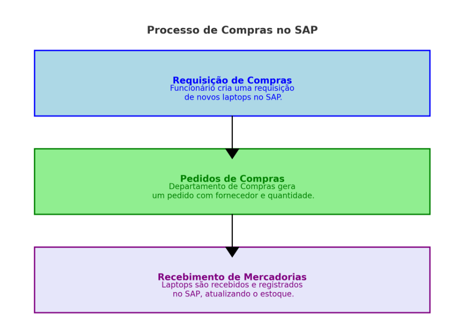

## INTRODUÇÃO

Olá, pessoal! Hoje vamos falar sobre um assunto muito interessante: SAP e a Otimização de Processos no Setor de Compras. Este sistema é de extrema importância e ajuda, principalmente, para quem atua nesta área.

## O QUE É SAP?
O que é SAP MM?
O SAP MM (Gerenciamento de Materiais) é um módulo do sistema SAP ERP que cuida do gerenciamento de materiais, estoque e compras. Ele garante que a empresa tenha os materiais certos na quantidade certa, no momento certo. Imagine-o como o “guardião” dos suprimentos dentro da organização.

## DEPARTAMENTO DE COMPRAS
O que faz um departamento de Compras?
O departamento de compras é responsável por adquirir todos os materiais necessários para manter a empresa funcionando. Isso inclui fazer cotações, negociar com fornecedores e emitir ordens de compra. Por exemplo, quando você precisa comprar papel para a impressora da empresa, o departamento de compras entra em ação.

## EXEMPLOS

Exemplos práticos do uso do SAP no setor de Compras

Requisição de Compras: Imagine que um funcionário precisa de novos laptops para a equipe. Ele cria uma requisição de compras no SAP, especificando os detalhes dos laptops necessários. Isso inicia o processo de aquisição.

Pedidos de Compras: Com base na requisição, o departamento de compras gera um pedido de compra no SAP. Esse pedido contém informações como o fornecedor escolhido e a quantidade de laptops. É como fazer uma lista de compras oficial.

Recebimento de Mercadorias: Quando os laptops chegam, o departamento de compras registra o recebimento no SAP. Isso atualiza o estoque e permite que a empresa saiba que os laptops estão disponíveis para uso.

## COMO SAP OTIMIZA O SETOR DE COMPRAS

Como o SAP MM pode otimizar os processos no setor de compras de uma empresa?

O SAP MM automatiza e agiliza todo o fluxo de suprimentos. Ele ajuda a evitar a falta de materiais, reduzir custos e melhorar a eficiência. Por exemplo, ao usar o SAP MM, a empresa pode planejar compras com antecedência, negociar melhores preços com fornecedores e rastrear todo o processo de aquisição.

## VANTAGENS DE SE UTILIZAR O SAP NO DEPARTAMENTO DE COMPRAS

Automação de processos: Reduz o trabalho manual ao automatizar tarefas repetitivas, como a criação de pedidos e o acompanhamento do estoque.

Visibilidade e controle: Oferece uma visão clara e em tempo real dos níveis de estoque, pedidos em andamento e histórico de compras.

Precisão nas compras: Minimiza erros humanos, como pedidos duplicados ou falta de materiais essenciais, garantindo que as compras sejam feitas de forma precisa.

Eficiência nas negociações: Permite comparar rapidamente os preços de diferentes fornecedores, ajudando a obter as melhores ofertas e economizar dinheiro.

Rastreamento e conformidade: Facilita o acompanhamento das entregas e garante que as compras estejam em conformidade com as políticas da empresa.

Integração com outros módulos: Pode ser integrado com outros módulos do SAP, como finanças e controle de produção, proporcionando uma gestão mais integrada e eficiente.

Relatórios e análises: Gera relatórios detalhados e análises sobre o desempenho das compras, ajudando na tomada de decisões estratégicas.

Melhora no relacionamento com fornecedores: Facilita a comunicação e a gestão dos contratos com fornecedores, fortalecendo parcerias comerciais.

## CONCLUSÃO

Curtiu esse conteúdo? Ele foi gerado por inteligência artificial, mas foi revisado por alguém 100% Humano, e se quiser se conectar comigo, me siga no LinkedIn!

## HASHTAGS

Hashtags
#SAP #Compras #Eficiência